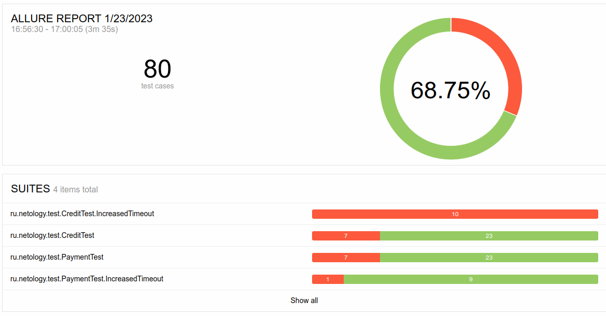

# Отчёт по итогам тестирования

## 1. Планирование
В начале было проведено исследовательское тестирование системы, в результате которого был составлен план тестирования, включающий 80 тест-кейсов для автоматизации (по 40 для каждой формы). [Посмотреть план автоматизации тестирования](https://github.com/Evgenia450/qa-netology-diplom/blob/main/docs/Plan.md)

## 2. Автоматизированное тестирование

В процессе автоматизированного тестирования пройдены 80 тест-кейсов (40 для формы обычного платежа, 40 для формы для заявки на кредит), из них:

- пройдены успешно: 55 (68,75%)
- пройдены неудачно: 25 (31.25%)

По результатам тестирования:

- добавлены 8 баг-репортов ([в разделе Issues (фильтр по лейблу bug)](https://github.com/Evgenia450/qa-netology-diplom/issues?q=is%3Aopen+is%3Aissue+label%3Abug)
